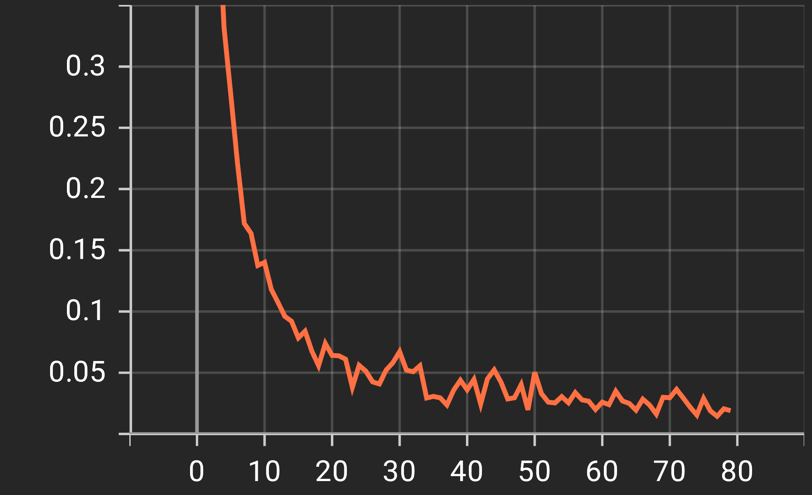
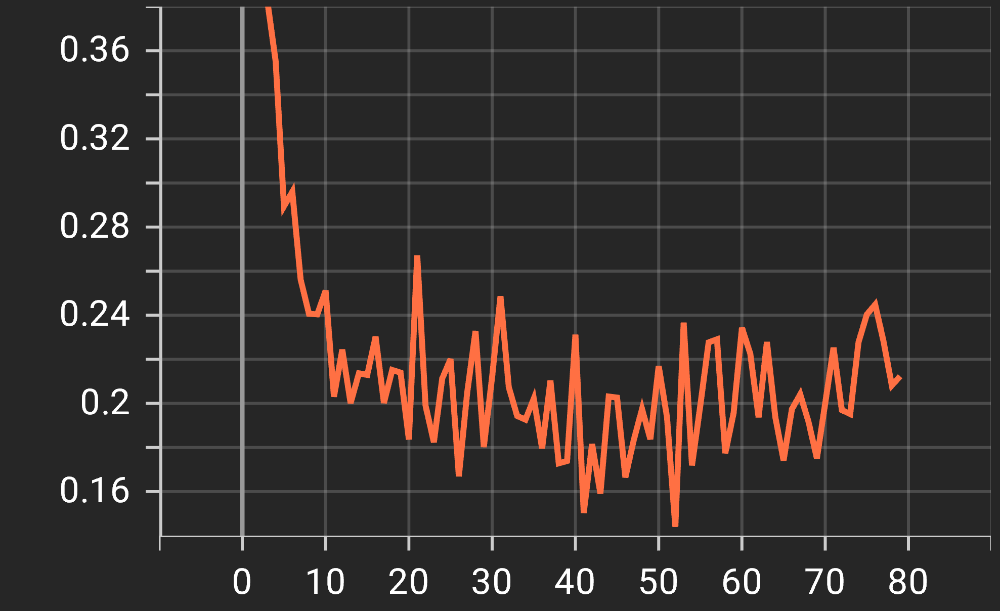
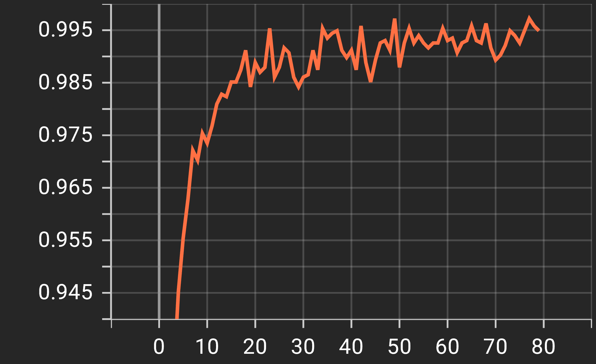
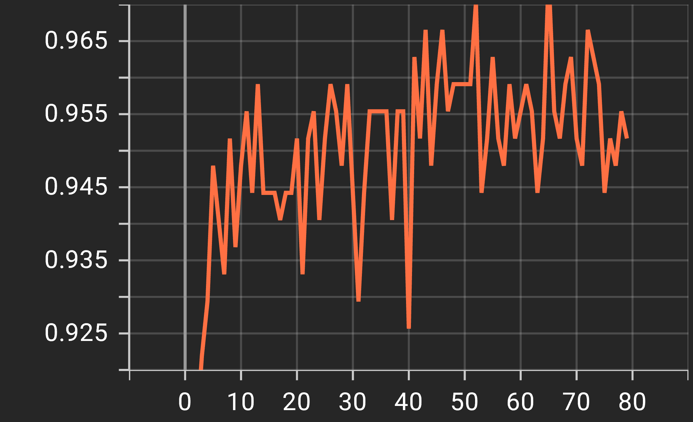
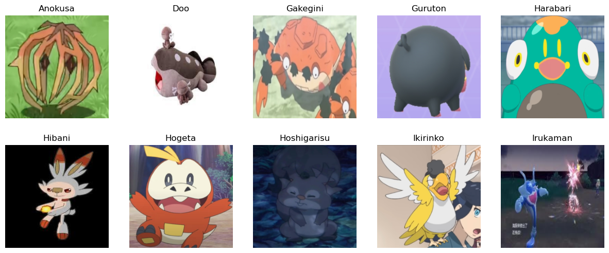
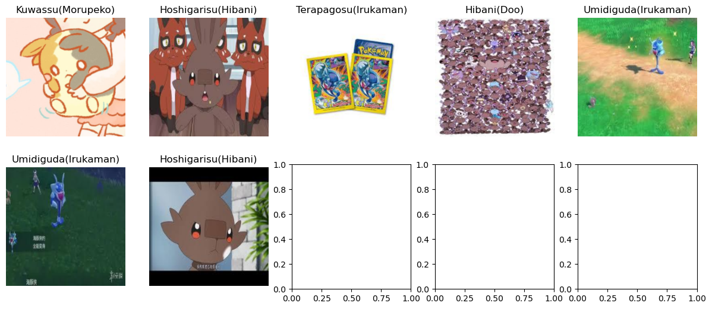

# New Gen Pokédex
本專案的目標為使用深度學習方法辨識寶可夢的種類。  
資料集為自行建置的第八與第九代部分寶可夢的影像，使用此資料集訓練了一個Vision Transformer模型。  

透過此方法訓練的模型在Testing Set上可達到97.4%的準確率。

## Dataset
### pokemon_gen8&9
[Google Drive](https://drive.google.com/drive/folders/1Yp5gIfrJvzCMWB4K2geFAF0IUCsboCfM?usp=sharing)

全30種寶可夢，本專案去除樣本過少之類別，共採用28種類別。

資料集進行逐類別分割，分割比例如下：  
訓練集：驗證集：測試集 = 8：1：1

## Data Augmentation
* 隨機縮放裁切
* 隨機水平翻轉
* 隨機垂直翻轉
* 隨機旋轉
* 自動增強
* 正規化

## Training
Model: ViT-B/32 (Vision Transformer)  
Loss Function: Cross Entropy (Implement Class Balancing)  
Optimizer: AdamW  

## Results
### Training Loss

### Validation Loss

### Training Accuracy

### Validation Accuracy

### Correct Inference

### False Inference

